# InterfacePhononsToolkit — a Python Set of Libraries for Computing Phonons Behavior at the Interfaces

<div align="justify">
  
*InterfacePhononsToolkit* is a collection of tools for setting up, performing, analyzing molecular dynamic simulations of heat flow at the interfaces and computing thermodynamic properties of the boundaries. This collection includes a generic Monte Carlo ray tracing model to unveil anticorrelated heat current phenomenon in materials containing nanoscale pores (with a new rigorous mathematical implementation), A new analytical model to compute thermal conductivity of dielectrics containing nanoscale porosity, a set of libraries to generate phonon Gaussian wavepackets to compute phonon transmission matrices across solid-solid interfaces, a collection of tools to analyze lattice vibrational behavior in heterogeneous structures, and a Monte Carlo model to compute phonon lifetime in microstructures containing nanograins/ nanoscale pore

</div>


- [GETTING STARTED](#GETTING-STARTED)
- [INSTALLATION](#INSTALLATION)
- [RAY TRACING MODEL](#RAY-TRACING-MODEL)
  * [Analytic Model of Uncorrelated Scattering](#Analytic-Model-of-Uncorrelated-Scattering)
  * [Monte Carlo Ray Tracing Model of Correlated Scattering](#Monte-Carlo-Ray-Tracing-Model-of-Correlated-Scattering)
  * [Pore Scattering Models](#Pore-Scattering-Models)
    - [Diffuse and specular wall scattering models](#Diffuse-and-specular-wall-scattering-models)
    - [Diffuse and specular palisade scattering models](#Diffuse-and-specular-palisade-scattering-models)
- [EFFECTIVE THERMAL CONDUCTIVITY IN MATERIALS CONTAINING NANOSCALE POROSITY](#EFFECTIVE-THERMAL-CONDUCTIVITY-IN-MATERIALS-CONTAINING-NANOSCALE-POROSITY)
  * [Descriptor](#Descriptor)
  * [Descriptor for L<sub>c</sub>](#Descriptor-for-L<sub>c</sub>)
  * [Model Prediction](#Model-Prediction)
- [PHONON WAVEPACKET ANALYSIS](#PHONON-WAVEPACKET-ANALYSIS)
  * [Model Development](#Model-Development)
  * [Atomistic Decomposition of Partitioning Ratio](#Atomistic-Decomposition-of-Partitioning-Ratio)
- [CITATION](#Citation)

# GETTING STARTED

<div align="justify">

The overall structure of the repository is as below.
    
    ├── Examples             # Tutorials, sanity and performance checks
    ├── Figures              # List of figures generated by Thermoelectric.py
    ├── ThirdPartyTools      # Thirs party tools used in this project
    ├── docs                 # The pdf manual of Thermoelectric.py
    ├── src                  # Python source files of the project 
    ├── requirements.txt 
    └── README.md

The best place to start is the *examples* folder, where there are a couple of scripts available to get you started with the code. A quick description of the notebooks is as the following.

    ├── Examples 
    │   ├── Si_Ideal_Filtering    # Example of running simulation to model idal filtering Si
    │   ├── Si_Nanocomposite      # More involving example of thermoelectric properties in Si containing SiC nanoparticles
    │   ├── README.md            

</div>

# INSTALLATION

Compatible with python 3.0 and upwards
```bash
git clone https://github.com/ariahosseini/InterfacePhononsToolkit.git
cd InterfacePhononsToolkit/
pip install --upgrade pip
pip install -r requirements.txt
```

You may need to define the following environment variable in your .bashrc or .bash_profile

```bash
export PYTHONPATH=/PATH/TO/InterfacePhononsToolkit/util:$PYTHONPATH
```

# RAY TRACING MODEL

<div align="justify">
  
  <p>
  
  It is difficult to infer the phonon scattering behavior that gives rise to the anticorrelation in HCACF directly from the shape of the HCACF curve. To circumvent this difficulty, we have developed a Monte Carlo phonon ray tracing model which allows us to test how different scattering behavior that could be occurring at pores would be manifest in the HCACF, allowing us to seek signatures of different scattering phenomena in the HCACF obtained from the MD simulations. Phonon ray tracing models have been used to great effect by several other researchers to identify signatures of ballistic transport in a variety of nanoscale geometries. What sets our use of the ray tracing model apart is that rather than using it to predict thermal transport, we use it to construct the heat current autocorrelation function. 
 </p>
 
## Analytic Model of Uncorrelated Scattering
<p>
  
To begin, we lay out the theoretical basis for the ray tracing model by establishing that macroscopic thermal conductivity can be computed from the sum of the autocorrelation functions of the individual phonon modes’ occupancy fluctuations. 
 </p>
 
 <p>
  
The Green Kubo equation gives the thermal conductivity tensor as the integral of the total heat current autocorrelation function:
 </p>
 
<p align="center">

</p>

<p>
  
where J<sub>kp</sub>(t) is the total instantaneous heat flux at time t, in the volume of materials V that is at thermal equilibrium at temperature T. The autocorrelation function 〈J<sub>kp</sub>  (t)⊗J<sub>kp</sub>(t+τ)〉 is the time-averaged dyadic of the heat fluxes an interval τ apart. The contribution to the heat current from the mode with wave vector k and polarization p is
 </p>
 
<p align="center">

</p>

<p>
  
where n<sub>kp</sub>(t) is the mode’s occupancy at time t. This can be rewritten in terms of the average flux and the instantaneous excursion from the average:
</p>

<p align="center">

</p>

<p>
  
where 〈n<sub>kp</sub>〉 is the Bose-Einstein occupancy
</p>

<p align="center">

</p>

<p>
  
and ω ̃<sub>kp</sub> is the dimensionless mode frequency ω ̃<sub>kp</sub>= ℏω<sub>kp</sub>/(k<sub>B</sub>T). The total instantaneous heat flux is then the sum of contributions from all modes,
</p>

<p align="center">

</p>

<p>
  
where the mean flux from pairs of modes with opposite k has canceled one another so that the net flux only depends on the sum of occupancy excursions from the mean. If the occupancy fluctuations in one mode are uncorrelated with the fluctuations in the other modes then when expanding the product of the sum of modal fluxes, the cross-correlations between modes will be zero simplifying the total correlation function to the sum of autocorrelation functions for each mode individually:
</p>

<p align="center">

</p>

<p>
  
This, in turn, depends only on the autocorrelation of the occupancy fluctuations 
</p> 

<p align="center">

</p>

<p>
  
Where the shorthand notation vv<sub>kp</sub> = (v<sub>kp</sub>⊗v<sub>kp</sub>) has been used for the tensor product of the group velocity. 
</p>

<p>
  
The occupancy n(t) of a phonon mode will be a random stepped function in time as shown in Figure below with phonon mode holding a constant excitation for some duration before anharmonic interactions with other phonon modes lead to scattering and a reset of the mode’s excitation. This function can be expressed as a sum of boxcar functions that represent the occupancy during the interval between successive scattering events 
</p>

<p align="center">

</p>

<p>
 
where Π<sub>(a,b)</sub>(t) is the boxcar function (plotted in blue in the top pane of Figure below) 
</p>

<p align="center">

</p>

<p>
  
and n<sub>i</sub> and θ<sub>i</sub> are the size and duration of the i-th occupancy fluctuation, and the fluctuations abut one another so that  θ<sub>i</sub>=t<sub>i+1</sub>-t<sub>i</sub>. 
</p>

<p>
  
If the probability of the i-th occupancy n<sub>i</sub>  and its duration θ<sub>i</sub> are independent from the fluctuations that proceeded it (as in the figure above), then the occupancy is only correlated during the intervals between scattering and so the occupancy correlation function reduces to simply the average of the correlation functions for each excursion with itself
</p>

<p align="center">

</p>

<p>
  
where the subscripts have been dropped temporarily for clarity. Here R<sub>n</sub> is the average rate of scattering events that leave the mode with occupancy n, and P<sub>θ ̅</sub>(θ) is the probability that a fluctuation of occupancy n survives for time θ before scattering given that the average duration of fluctuations is θ ̅. The term A(τ,θ) is the autocorrelation function of a single boxcar function
</p>

<p align="center">

</p>

<p>
  
with H(x) is the Heaviside theta function. The integral of the boxcar’s autocorrelation function is 
</p>

<p align="center">

</p>

<p>
  
The upper pane of Figure below shows the boxcar function for a single fluctuation, with the lower pane showing its autocorrelation function and integral. The integrated ACF converges to 
</p>

<p align="center">

</p>

<p>
  
If the scattering processes that lead to the occupation fluctuations are random, then occupation times θ are drawn from the Poisson distribution of waiting times
</p>

<p align="center">

</p>

<p>
  
The rate, R<sub>n</sub>, of scattering into occupancy n is related to the thermodynamic probability P<sub>n</sub> of finding the mode in its n-th state of occupancy by
</p>

<p align="center">

</p>

<p>
  
where P<sub>n</sub> is the probability distribution for the canonical ensemble
</p>

<p align="center">

</p>

<p>
  
Using Equations above and performing the integral over lifetimes and summing over n gives:
</p>

<p>
  
Performing the averaging over all possible occupancies gives
</p>
  
<p align="center">

</p> 

<p>
  
and averaging over all possible fluctuation durations gives 
</p>

<p align="center">

</p> 

<p>
  
The cumulative thermal conductivity tensor is then
  </p>
  
  <p align="center">

</p> 

<p>
  
which after some mathematical manipulation simplifies to
</p> 

 <p align="center">

</p>

<p>
  
The first term in parenthesis is the mode’s volumetric specific heat. If the phonon modes all have the same scattering rate and group velocity and assuming cubic symmetry, the first element of the thermal conductivity tensor reduces to the well-known result from kinetic theory:
  </p>
  
  <p align="center">

</p>

<p>
  
where C<sub>v</sub>, v ̅<sub>g</sub> and λ are the systems volumetric specific heat, group velocity, and mean free path.  This result shows that in order to understand the HCACF and the reduction in thermal conductivity we need only consider just the autocorrelation of individual occupancy fluctuation or phonon wavepackets by themselves, and thus provides the formal theoretical footing for the ray tracing model that follows. Before moving on to the ray tracing model, however, we make note of several insights that can be obtained from the analysis above. 
</p>

<p>
  
The correlation function in Equations above decays (and the cumulative conductivity saturates) exponentially over a correlation time equal to the mean phonon scattering time θ ̅, so is all modes have the same lifetime the cumulative thermal conductivity distribution over correlation time τ is
</p>

<p align="center">

</p>

<p>
  
This masks the importance for the transport of heat of long-lived occupancy fluctuations in the tail of the Poisson distribution of lifetimes. The contribution that occupancy fluctuations make to the thermal conductivity is proportional to their lifetime squared, and so we can compute the cumulative thermal conductivity distribution over phonon lifetimes as 
</p>

<p align="center">

</p>

<p>
  
These equations are plotted in figure below where it can be seen that the short-lived fluctuations (small θ) contribute very little to the thermal conductivity while the cumulative conductivity distribution in τ  rises rapidly at small correlation times. This illustrates the conceptual difference between fluctuation duration θ and correlation time τ; the change in κ(τ) at correlation time τ includes contributions from all fluctuations with θ>τ.  It is common in heat transport texts to see plots of the cumulative contribution to thermal conductivity over the distribution of phonon modes’ mean free paths in a crystal κ(λ), and so we take pains here to point out that the κ(θ) distribution in the figure is due to the shot noise in a mode with average scattering rate θ ̅, it is not from a distribution different θ ̅ over different modes. However, the effect of this noise is significant, with a large contribution to the total conductivity coming from a small number of phonons that travel ballistically over distances many times longer than the mean free path before scattering. This point is further emphasized by computing the cumulative conductivity distribution over the fraction ϕ of occupancy fluctuations ranked in ascending order of their longevity,
</p>

<p align="center">

</p>

<p>
  
as is plotted in Figure below. In fact, more than 50% of the heat transported is carried by just 7% of phonons that survive for more than 2.7 times the average phonon lifetime θ ̅. It can also be seen that 80% of the heat current comes from fewer than 20% of the phonon mode occupancy fluctuations. This matches Pareto’s 80-20 rule that is a signature of Lévy flights, although in this case, the distribution of flight lengths is not fractal (power-law), and so this behavior is not a true Lévy flight. The outsized importance of the long-lived phonons is significant as it implied that ballistic effects for heat transport in nanoscale systems should become significant at system sizes significantly larger than the phonons’ nominal mean free path. This observation also has important ramifications for deterministic simulations of the Boltzmann transport equation (BTE) for phonons, implying that to correctly predict the heat conduction due to phonon transport in nanostructured material, one must smear the intrinsic distribution of average phonon lifetimes by the Poisson distribution — a practice that is often overlooked in frequency-dependent and multi-grey BTE simulation.
</p>

<p>
  
In addition to computing the contribution from different occupancy durations, it is also insightful to consider the cumulative distribution contribution from different occupancy
</p>

<p align="center">

</p>
  
<p>
  
as plotted in Figure below with values for ω ̅ of 0.5, 1.0, and 1.5 (which corresponds to average occupancies of 〈n〉 of 0.16, 0.58, and 1.1). It can be seen that because of the (n-〈n〉)<sup>2</sup> dependence on the ACF infrequency multiple phonon excitations of the modes account for a large fraction of the heat carried, even at temperatures where 〈n〉~ 0.5. This suggests that scattering processes involving four or more phonons, although rare, will have a significant impact on the overall thermal conductivity, even at low temperatures.
</p>

## Monte Carlo Ray Tracing Model of Correlated Scattering 

<p>
  
To isolate the effects that arise from correlated scattering we study a simpler model system consisting of a grey population of phonons in which we assume that all phonon modes have the same frequency ω, group velocity v<sub>g</sub>, and mean intrinsic scattering lifetime θ ̅.  The derivation above shows that the HCACF can be constructed by considering each correlated heat carrier event in isolation and then averaging their contribution to the total HCACF. For a wave packet scattered elastically from one mode (with wavevector k and polarization p) into another mode (k'p') by an interface, one must consider the flight of both the incident wavepacket and the scattered wavepacket together as the occupancy fluctuations in kp and k'p' modes are now (anti)correlated. This is true even in the case of diffuse scattering, where the choice of the scattered k' mode is independent of the incident mode, as after scattering the sign of the velocity component perpendicular to the interface is reversed, making heat flux in that direction after scattering anticorrelated with the flux before scattering. As we now have to consider the sequential occupancy of two or more modes, rather than compute the occupancy auto- and cross-correlations of the modes we instead consider the heat current from individual wavepackets of lattice vibration, starting from their birth, and following them as they are scattered elastically through a series of different phonon modes, up until the uncorrelated phonon-phonon scattering event that causes their annihilation. An example of such a trajectory is shown in the figure with the resulting heat flux along x and its autocorrelation function shown in Figure bellow.
</p>

<p>
  
In using this conceptually subtly different approach of following wavepackets rather than occupancy fluctuations, we can apply some of the insights from the derivation above to write the autocorrelation function of the heat current fluctuations along the x direction as the average of the heat flux autocorrelation functions of wavepackets with unit magnitude
</p>

<p align="center">

</p>

<p>
  
where D is the density of states (the number of phonon modes per unit volume), and A<sub>xx</sub>(τ,θ,r,Ω ̂ ) is the autocorrelation function of the heat flux along x created by a unit wavepacket that was born at location r, traveled initially along direction Ω ̂, and lived for duration θ, before being annihilation into the phonon bath. The total thermal conductivity reduction can thus be computed as: 
</p>

<p align="center">

</p>

<p>
  
As this population phonons are in a volume that includes physical scattering centers such as pores and inclusions, in addition to averaging over the phonon lifetimes θ, the average 〈A<sub>xx</sub>(τ',θ,r,Ω ̂ )〉 is also taken over the spatial domain r, the phonon modes Ω ̂, and the various possibilities for the reflected wave packet at each correlated scattering events. 
</p>

<p>
  
Rather than perform the average analytically, we average using Monte Carlo sampling — tracing the trajectory of wavepackets as they collide with pores and are scattered off into new directions. In this scheme we took the average HCACF from 20,000 randomly sampled wavepacket trajectories; each beginning from a randomly selected starting point, with random initial direction, and with a lifetime drawn randomly from the Poisson distribution. The single wavepacket HCACFs in the x, y, and z directions were computed numerically out to a correlation time of 20 times the mean scattering time θ ̅ to prevent truncation of contributions from long-lived phonons in the tails of the Poisson distribution. This averaging was sufficient to reduce the uncertainty in the computed values of κ<sub>bulk</sub> to < 3%. The details of how the correlated scattering from pores was modeled are described in the next section.
</p>

## Pore Scattering Models

<p>
  
The HCACF from the MD simulations of material containing cylindrical pores shows a single pronounced region of anticorrelation. The correlation time at which the HCACF is most negative changes with the distance d between the ranks of pores but is characterized by single effective velocity v_dip which is found to be 0.6XXX of the averaged acoustic phonon velocity. Finally, the anti-correlation effect can be very large, with the final thermal conductivity of the material containing pores κ<sub>∞</sub> being as little as 20% of the peak cumulative thermal conductivity, κ<sub>peak</sub>. This implies that the motion of phonons after scattering, on average, undoes 80% of the heat conduction by the phonons before they were scattered from the pores. With the ray tracing model, we aim to understand what factors in the scattering of phonons from pores affect these three factors: single vs multiple anticorrelation, v<sub>dip</sub>, and κ<sub>peak</sub>/κ<sub>∞</sub>.  For this, we consider the effect on the HCACF from four phenomenological models of phonon scattering from scattering centers separated by distance d in the material. Two geometries of scattering centers are considered: an array of parallel permeable planer walls, and a series of palisades of cylindrical pores. For each geometry we examined the effect of both specular and diffuse phonon scattering by the obstacles, giving us four scattering models in total. The two geometries have a single geometric degree of freedom α that is related to the probability that phonons are not scattered when they encounter the wall/palisade. 
</p>

### Diffuse and specular wall scattering models  

<p>
  
We represent the pores in MD simulation as a series of parallel planer interfaces perpendicular to the x-axis. The spacing, L<sub>p</sub>, between planes is described in terms of the Knudsen number Kn=(v<sub>g</sub> θ ̅)/L<sub>p</sub>. When a phonon encounters an interface there is a finite probability 1-α that it will pass through with its trajectory unaltered, otherwise, the phonon is reflected. For the specular model, reflection involves only flipping the direction of the x-component of the velocity. In the diffuse model, a new random directory is chosen in the half-space perpendicular to the reflection plane, so that the x-component of the velocity of the scattered phonon has the opposite sign from the incident phonon.  Simulations were performed sweeping α from 0 to 1 and log⁡(Kn) from -1 to 1. Although we refer to this model as the interface model, it is a reasonable representation of scattering from rectangular pores.

### Diffuse and specular palisade scattering models 

<p>
  
With the palisade model we aim to more closely mimic the pore geometry simulate in the MD simulations. We assume that the material contains rows of cylindrical pores, each with radius r and aligned with their axis parallel to the y-direction. The pores are arrayed in the z-direction with spacing L to form a palisade fence. The geometry of the palisade is parameterized the parameter α=2r/L which is the scattering probability for phonons that meeting the palisade head-on. In general, the probability that phonons are scattered by the pores rather than passing between them is a function of incidence angle, χ, of the phonon trajectory in the x-z plane with the x-axis. The transmission probability depends on the gap between cylinders that is visible to the phonons as they travel towards the palisade, given by

<p align="center">

</p>

<p>
  
Here tan⁡χ=v<sub>z</sub>/v<sub>x</sub>. The probability of transmission drops to zero at grazing angles of incidence where the shadow of the cylinder one another. Rather than models the location of cylinders explicitly we consider the probability that an incident phonon strikes a cylinder at a position with normal vector at an angle of β relative to the phonon direction. This probability is given by P(β)=cos⁡β/(sin⁡(β<sub>max</sub>)-sin⁡(β<sub>min</sub>)), where β<sub>min</sub> and β<sub>max</sub> are the limits to the possible incident angles that a phonon could strike the surface of a cylinder. If there is no shadowing β<sub>min</sub>=-π/2, and β<sub>max</sub>=π/2. Shadowing occurs at angles when T(χ)<0, and in these cases: 
</p>

<p align="center">

</p>

<p align="center">

</p>

<p>
  
For the specular scattering model, when a phonon’s x position lies on a palisade a pseudorandom number generator is used to decide if the phonon passed through the barrier unscattered or if it struck on of the pillars. If scattering occurs the incidence of a random incidence angle is selected from P(β) and the phonon is set on a new trajectory with a new angle 
</p>

<p align="center">

</p>

<p>
  
Note that this mean-field model of scattering does not resolve the physical size of the pores and the possibility of multiple scattering between neighboring cylinders within a palisade is not considered. 
</p>

<p>
  
The model for diffuse scattering from cylindrical pores uses the same procedure to stochastically select the normal at the point on the surface of the cylinder that the phonon strikes (this has an angle χ'=χ+π-β).  A new random direction is then selected for the phonon in the half-space defined by this normal vector. 
</p>

<p align="center">
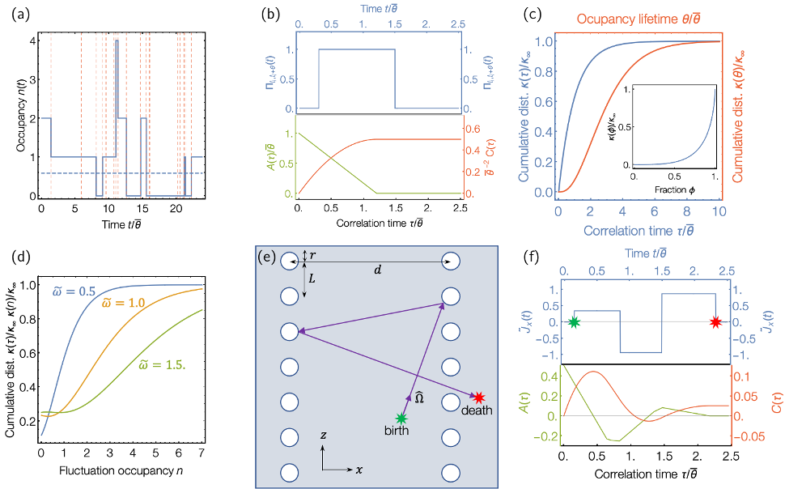 
</p>

# EFFECTIVE THERMAL CONDUCTIVITY IN MATERIALS CONTAINING NANOSCALE POROSITY

## Descriptor

<p>

The effective thermal conductivity materials containing nanoscale pores is given by
</p>

<p align="center">

</p>

<p>
  
where S(Λ) is the phonon suppression function describing the scattering events at the interface of the pores for the phonon with mean free path of Λ and K(Λ) is the mean free path dependent thermal conductivity of the bulk material. In diffusive regime, for gray phonons, S(Λ→0,L_c )≈(1-ϕ)/(1+ϕ), which is in agreement with Maxwell-Garnett prediction, while in ballistic regime, S(Λ→ ∞,L<sub>c</sub> )≈L<sub>c</sub><sup>-1</sup>. We remark that for a given porosity of ϕ, the specific heat and group velocity of the porous materials change as C(ϕ) = (1-ϕ) C<sub>bulk</sub> and ν(ϕ)=1/(1-ϕ) ν_bulk, and thereby the 1-ϕ term in C(ϕ) and 1/(1-ϕ) term in ν(ϕ) are canceled out in kinetic theory expression of thermal conductivity (κ≈1/3 CνΛ), leaving Λ the only parameter that S(Λ,L<sub>c</sub>) relies on.
</p>

<p>
  
Let's integrate by parts
</p>

<p align="center">

</p>

<p>
where the normalized cumulative thermal conductivity, α(Λ), is defined as
  
 </p>
 
 <p align="center">

</p>

<p>

and
</p>

<p align="center">

</p>

<p>

We note that
</p>

<p align="center">

</p>

<p>
  
therefore, we will have
</p>

<p align="center">

</p>

<p>
  
The cumulative thermal conductivity is often approximated by a logistic function in logarithmic abscissa as
</p>

<p align="center">

</p>

<p>
  
Here Λ<sub>o</sub> is a uniparameter used to fit the logistic function to the cumulative thermal conductivity. We use following form for the suppression function
</p>

<p align="center">

</p>

<p>
where L<sub>c</sub> is the mean distance phonons travel before being scattered by pores. In derivation of this equation, it is assumed that phonon-pore scattering happens independent from the phonon-phonon scattering and therefor Λ<sub>p</sub><sup>-1</sup> = Λ<sub>o</sub>+L<sub>c</sub><sup>-1</sup>. Here, S(0) is normalized diffusive thermal conductivity as S(0)=κ<sub>fourier</sub>/κ<sub>bulk</sub>. Thereby, we will have
  
</p>

<p align="center">

</p>

<p>
  
which leads to 
</p>

<p align="center">

</p>

<p>
  
where Ξ(Kn)=(1+Kn(Ln(Kn)-1))/(Kn-1)<sup>2</sup>. In this equation, Kn=Λ<sub>o</sub>/L<sub>c</sub> is the Knudsen number. This equation relates the effective thermal conductivity of porous materials and Knudsen number of Kn to bulk lattice thermal conductivity. Note that in diffusive regime where Kn << 1, this equation simplify to the diffusive heat conduction equation through κ<sub>bulk</sub>S(0)=κ<sub>fourier</sub>. In the remaining of this section, we describe the best descriptors for L<sub>c</sub> and S(0). 
</p>

## Descriptor for L<sub>c</sub>

<p>
  
The L<sub>c</sub> shows the average interval for a free-flying phonon to collide with a boundary. Minnich and Chen defined L<sub>c</sub> as
</p>

<p align="center">

</p>

<p>
  
For cylindrical pores, equation this equation leads to
</p>

<p align="center">

</p>

<p>
  
where L<sub>p</sub> is the distance between the pores. In the limit of high porosity, the mean free path of the phonons colliding with pores is expected to tend to zero, thereby Machrafi and Lebon proposed

</p>

<p align="center">

</p>

<p>
  
that differs from equation above by a factor of 1-ϕ in the numerator. Liu and Huang proposed 
</p>

<p align="center">

</p>

<p>
  
in which, λ<sub>i</sub> is the geometric average of phonon’s flying distance per number of collisions with the pores - proposed by Minnich in equation - and the inter-pore distance, and λ<sub>ii</sub> is the hydraulic diameter of the pore. For the aligned cylindrical pores, the inter-pore distance is L<sub>p</sub>-2r, where r is the radius of the pore, λ<sub>i</sub> = √ (L<sub>p</sub><sup>2</sup>)/2r(L<sub>p</sub>-2r) = L<sub>p</sub> √(1/√(ϕ/π)-1), and λ<sub>ii</sub> = 2r = 2L<sub>p</sub> √(ϕ/π). We refer to their original paper for the complete list of equations for L<sub>c</sub> in materials containing pores with different shapes. 
</p>

## Descriptor for S(0)

<p>
  
The term S(Λ→0,L<sub>c</sub> ) is a dimensionless figure shows the effect of pores on thermal conductivity in the diffusive regime (note that in this definition we neglect ballistic effects). In this manuscript, we briefly describe three models of S(0) and refer to literature for other available expressions.
</p>

<p>
  
The Maxwell-Garnett's model is simply
</p>

<p align="center">

</p>

<p>
  
This is the value obtained by diffusive heat conduction using Fourier’s law. Similar equation can be derived by performing angular average of the polar suppression for gray phonons.
</p>

<p>
  
The Maxwell-Eucken's model is
</p>

<p align="center">

</p>

<p>
We remark that, Nan's equation for multiphase structures reduced to the same equation for the porous materials. 
</p>

<p>
  
For cylindrical pore extended along **k** direction in Cartesian coordinates, the Rayleigh's model gives
</p>

<p align="center">

</p>


<p align="center">

</p>

<p>
  
and, thereby, the effective suppression function for cubic crystal structures, is S(0)=1/3 ∑S<sub>i</sub>(0) ≈ 3-ϕ-4ϕ/(1+ϕ+0.3ϕ<sup>4</sup>). Note that the Maxwell-Eucken's and Rayleigh's models give quite similar value for S(0). 
</p>

<p>
  
Using these equations, we will have
</p>
 
 <p align="center">

</p>

<p>
  
Similar equations can be used for structures with extended cubic and discrete spherical pores but with different L<sub>c</sub> terms of 1/√ϕ L<sub>p</sub> and 4/3 L<sub>p</sub> ∛(3/(4πϕ^2), respectively. Finally, we remark that for prism pores with equilateral triangle base, a better approximation for S(0) and L<sub>c</sub> are -4.37ϕ<sup>3</sup>+3.47ϕ<sup>2</sup>-2.67ϕ+1$ and √(ϕ√3)L<sub>p</sub>, respectively.
</p>

## Model Prediction

<p>
  
The cumulative thermal conductivity and suppression function for GaAs at 300 K are plotted in figures bellow. The blue line is mean free path thermal conductivity computed from first principles in *AlmaBTE*. The red line shows the logistic function fitted to cumulative thermal conductivity computed using DFT. Therefore, when the feature size in GaAs-based porous materials is less than roughly 183 nm, the phonon-pore scattering dominates over the anharmonic scattering. The logistic curve predicts Λ<sub>0</sub> = 183 nm. At the same temperature, the model prediction for Λ<sub>0</sub> in AlAs, InP, Ge is Λ<sub>0</sub> = 236 nm, Λ<sub>0</sub> = 803 nm, and Λ<sub>0</sub> = 296 nm, respectively. The blue curve second pane shows the suppression function computed from BTE simulation using *OpenBTE*. The green plot shows the logistic curve fitted to blue curve assuming that the suppression function converges to Maxwell-Garnett’s diffusive model when Λ→0. The curve predicts L<sub>c</sub> = 1.25 μm.  The red line shows the model prediction for the suppression function. This model predicts L<sub>c</sub> = 0.89 μm, slightly underestimating the feature size. We remark that, the model predictions of Machrafi and Liu  estimate L<sub>c</sub> = 0.66 μm and L<sub>c</sub> = 0.67 μm, respectively. In overall, the model prediction for cumulative thermal conductivity and the line-of-sight is in good agreement with first principles' prediction.
</p>

<p align="center">
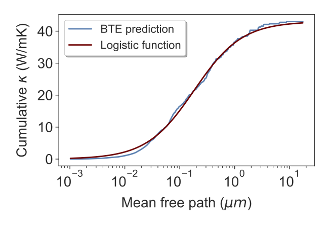 
</p>
<p align="center">
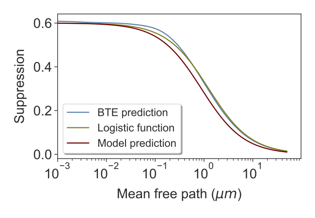 
</p>
  
<p>
  
Figures bellow show the model and BTE predictions of lattice thermal conductivity for Si, GaAs, InAs, and Sn at 300 K for different pore-pore spacing of L<sub>p</sub> but fixed porosity of 0.25 and 0.55, respectively. The model prediction is marked with open circle while BTE simulation is marked with open triangle. The model prediction is in excellent agreement with BTE prediction for pore-pore spacing as short as 10 nm up up to macro-level spacing and for porosity up to  ~0.6. For highly porous structures, the model slightly overestimates the thermal conductivity. 


<p align="center">
 
</p>

<p align="center">
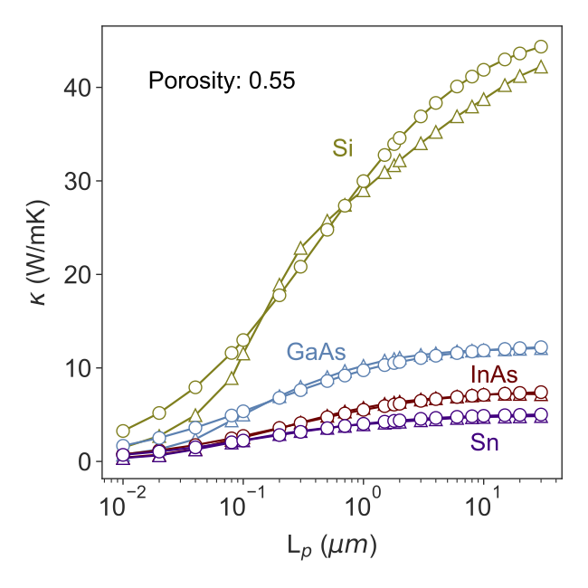 
</p>

Figure bellow shows the variation of thermal conductivity normalized with the bulk thermal conductivity with temperature for InP with 0.15 and 0.40 porosity plotted in blue and red, respectively. The pore spacing is fixed at L<sub>p</sub> = 500 nm. The model prediction is marked with open circle and BTE prediction is marked with triangle. The figure suggests the accuracy of the model for a wide range of temperature.
</p>

<p align="center">
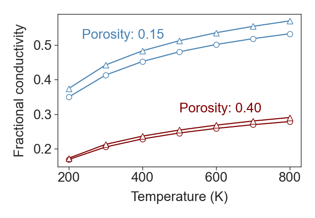 
</p>


<p>
  
In the following section, we use our model to predict the effect of porosity on thermoelectric (TE) performance of dielectrics. The energy performance of TE materials at a given temperature, T, is quantified by the dimensionless figure of merit, ZT = σS<sup>2</sup>/(κ<sub>e</sub> + κ<sub>l</sub>)T. Here, σ, S, κ<sub>e</sub> and κ<sub>l</sub> are electrical conductivity, thermopower, electrical thermal conductivity and lattice thermal conductivity, respectively. In dielectric TEs, electrical thermal conductivity is negligible and therefore we neglect κ<sub>e</sub> term in ZT. We remark that, in general, the charge carrier's (electron or hole) mean free path is much shorter than phonon mean free path so that in most cases, charge carrier transport is diffusive for pore-pore spacing much shorter than the spacing in which phonons start behave diffusively. In a recent work, we have developed a fast algorithm to compute electron-pore scattering rate from solving Fermi's golden rule. The model shows how careful tuning the carrier concentration can mitigate the effect of nanoscale pores on electrical conductivity through enhancing thermopower via selective electron energy filtering. Here, we consider two cases: discrete spherical pores and extended cylindrical pores, we also limit our study to diffusive regime (Kn≤1). We *emphasize* that the effective medium theory does not account for interface effects such as filtering effect and therefore the proposed model for TE ZT should be used by caution. In case of spherical pores, the effective medium theory formula for the electrical conductivity is
</p>

<p align="center">

</p>

<p>
  
We use following equation for thermopower
</p>

<p align="center">

</p>

<p>
  
This equation is valid when the phase grains are spherical without preferred orientations and arranged in a symmetrical fashion.  Using the model prediction for κ<sub>eff</sub>, we will have
</p>

<p align="center">

</p>

<p>
  
This equation relates thermopower in dielectrics containing spherical pores to bulk thermopower. We can derive the equation for ZT<sub>eff</sub> in this class of porous materials by substituting equations abouve in ZT formula as
</p>

<p align="center">

</p>

<p>
  
We remark that this equation is *only* valid materials with spherical pores (L<sub>c</sub> = 4/3 L<sub>p</sub> ∛3/(4πϕ^2)) in diffusive regime where Kn << 1. In case of extended cylindrical pores, the rate of electron scattering is dramatically less than discrete due to the limited number of states that are available to accept scattered electrons. Therefore changes in the electrical conductivity of dielectrics containing extended cylindrical pore is due to changes in volume-averaged electron density as
</p>

<p align="center">

</p>

<p>
  
The density of state exists in both denominator and numerator of thermopower so that the effect of volume averaging is canceled out. This is in agreement with Webman-Jortner-Cohen (WJC) model for the thermopower

</p>

<p align="center">

</p>

<p>
  
Finally, the TE ZT for materials containing extended cylindrical pores will be
</p>

<p align="center">

</p>

<p>
  
It is notable that, in general, the electron filtering effect in extended pores is negligible and therefore equation above does not suffer from the erroneous in previous equation and can be used for a wider range of Knudsen number.  
</p>


<p>
  
The variation of ZT<sub>eff</sub>/ZT<sub>ibulk</sub> with porosity and Knudsen number for discrete spherical pore and extended cylinder are shown in figures bellow, respectively. The model predicts that spherical pores detriment ZT for Kn≈1 while for Kn<1 it predicts enhancement in ZT. We *reemphasize* that the energy filtering effect is neglected in derivation of equation for S which by no means acceptable when Kn→1; However the model predicts improvement in ZT in all range of Kn with the largest enhancement in Knudsen regime for TEs with extended cylindrical pores - note that there is no filtering effect in materials with extended pore. 
</p>

<p align="center">
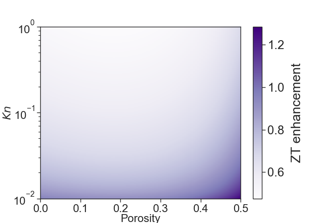 
</p>

<p align="center">
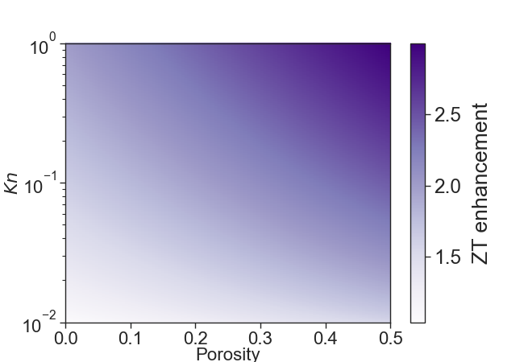 
</p>
  
# PHONON WAVEPACKET ANALYSIS

## Model Development

<p>
  
A phonon wavepacket is described as a localized wave function with well-defined position and momentum of constructive superposition of phonon in the vicinity of the localization eigenstate and destructive superposition away from the region of localization, formed by linear superposition of plane waves with different wavevectors and eigenmodes. The Gaussian phonon wavepacket in reciprocal space defines as
</p>

<p align="center">

</p>

<p>
  
Here, u<sub>ljζγ</sub> is the displacement of j<sup>th</sup> atom in l<sup>th</sup> unitcell along ζ<sup>th</sup> direction (x, y or z) of γ<sup>th</sup> mode. A<sub>o</sub> is an amplitude tuned to desired phononic temperature for each wavevector of k<sub>o</sub>, σ shows phonon uncertainty width in momentum space, ϵ<sub>jζ</sub> is j<sup>th</sup> phonon eigenmode along ζ, r<sub>l</sub> is pointing vector to l<sup>th</sup> lattice point, ω<sub>γ</sub> is the γ<sup>th</sup> mode of frequency for each wavevector and t is the time.
</p>

<p>
  
The sum over q is performed for all wave vectors in the first Brillouin zone that are commensurate with the compute cell. The phonon wave packet simulations are centered at wave vectors q<sub>o</sub> nm<sup>-1</sup> along the 〈 1 0 0 〉 crystal direction for both the longitudinal and transverse acoustic modes γ. Large simulation cells is needed to precisely model the wave packets with very fine uncertainty in momentum space(σ). The initial position of the atoms in the MD simulation is computed using Equation above and the initial velocity is computed from the derivative of u<sub>ljζγ</sub> with respect to time (v<sub>ljζγ</sub> = d/dt u<sub>ljζγ</sub>). The system is initially at 0 K and the wave packets are added with A<sub>o</sub> for each wave packet tuned so that it raises the temperature of the system by a few Kelvin, rather than adding one phonon, ℏω, of energy. The reason for this is that, in the system sizes modeled, ℏω for wave packets near the Brillouin zone center is too small to be resolved above the numerical noise, while a single ℏω would raise the system temperature by hundreds of Kelvin for wave packets near the Brillouin zone edge. Performing the wave packet simulations at lower energy help keep phonon thermalization at bay, such that the acoustic frequencies selected for the packets don’t easily decay into other modes/ frequencies due to anharmonicity.
</p>

<p align="center">
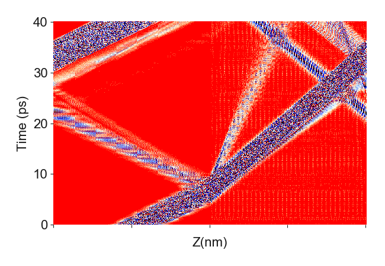 
</p>

<p align="center">
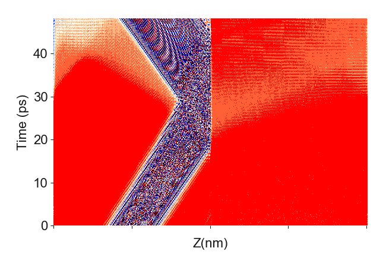 
</p>

<p align="center">
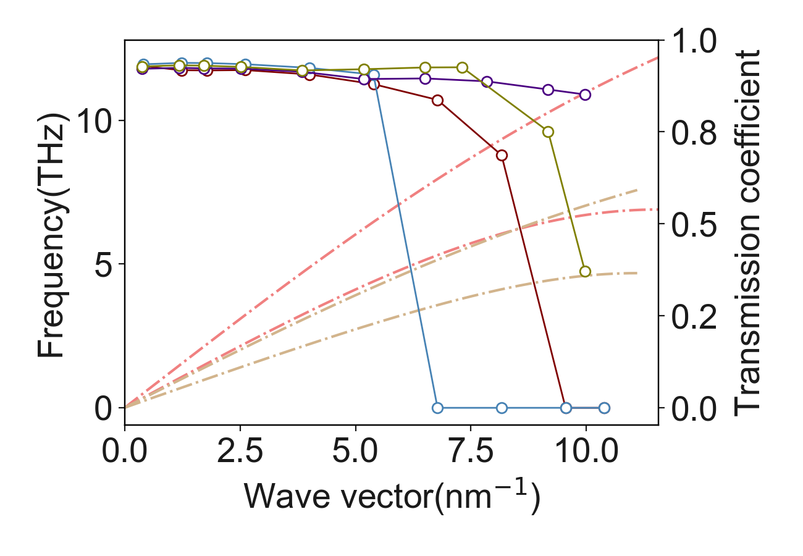 
</p>

<p align="center">
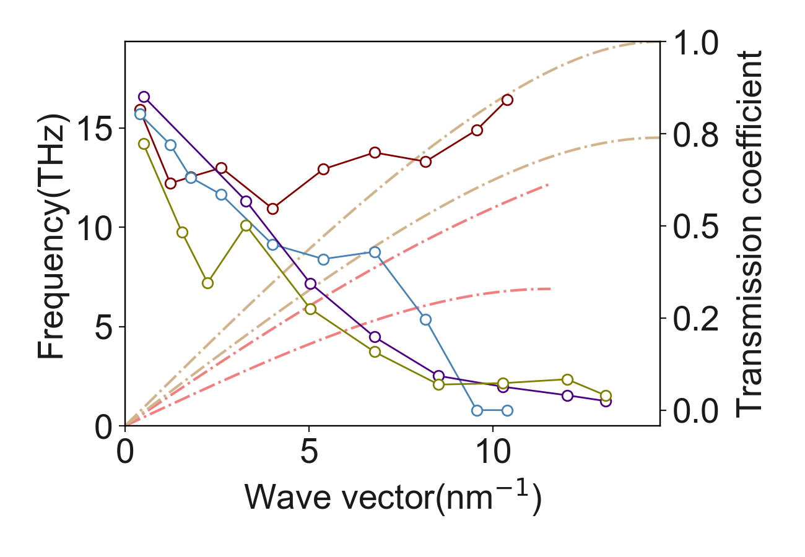 
</p>

## Atomistic Decomposition of Partitioning Ratio

<p>
The importance of the interfacial atoms can be shown by the degree of participation in different phonon modes using participation ratio (PR). AAtomistic decomposition of partitioning ratio (APR) shows the contribution of each atom to the lattice dynamics for a given frequency. These parameters are described as
</p>  
  
<p align="center">

</p>

<p align="center">

</p>

<p>
Here we proposed local partition ration (LPR) as the sum of APR for the atoms at a local neighborhood of atoms.
</p>


<p align="center">

</p>

<p>
The local partition ration of (a) Si/Ge and (b) Si/SiC are plotted in figure (4). The interfacial modes and local characteristic of phonons in Si/SiC interface is distinguishable in this figure. On the contrary, atoms at the interface of Si/Ge behaves similar to atoms far from the interface.
</p>


<p align="center">
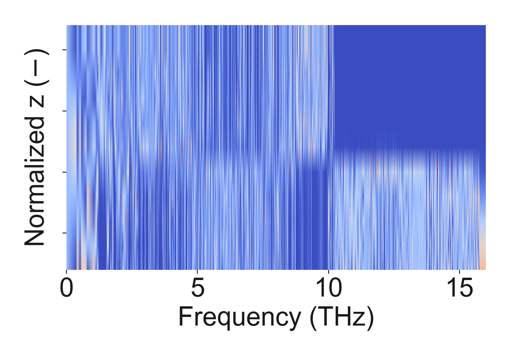 
</p>

<p align="center">
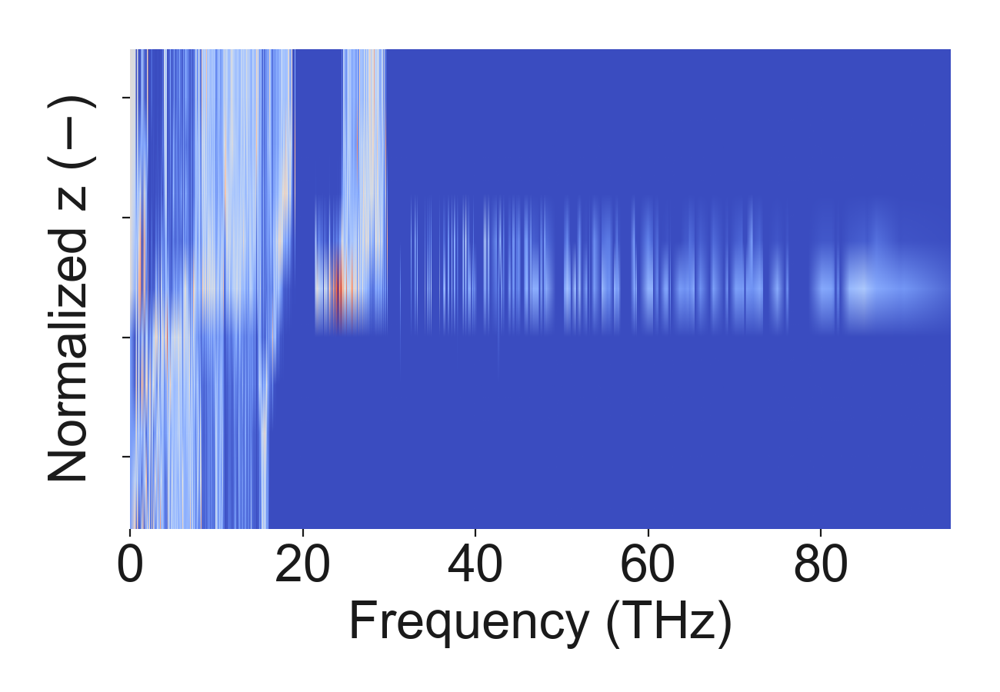 
</p>

# CITATION

[1] de Sousa Oliveira, L., Hosseini, S. A., Greaney, A., \& Neophytou, N. (2020). Heat current anticorrelation effects leading to thermal conductivity reduction in nanoporous Si. Physical Review B, 102(20), 205405. [\href{https://journals.aps.org/prb/abstract/10.1103/PhysRevB.102.205405}{Online version}]

@article{de2020heat,
  title={Heat current anticorrelation effects leading to thermal conductivity reduction in nanoporous Si},
  author={de Sousa Oliveira, Laura and Hosseini, S Aria and Greaney, Alex and Neophytou, Neophytos},
  journal={Physical Review B},
  volume={102},
  number={20},
  pages={205405},
  year={2020},
  publisher={APS}
}


